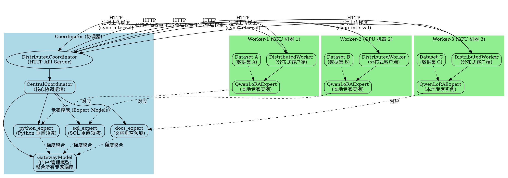
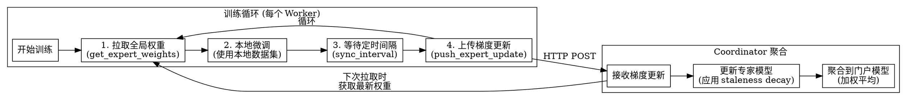
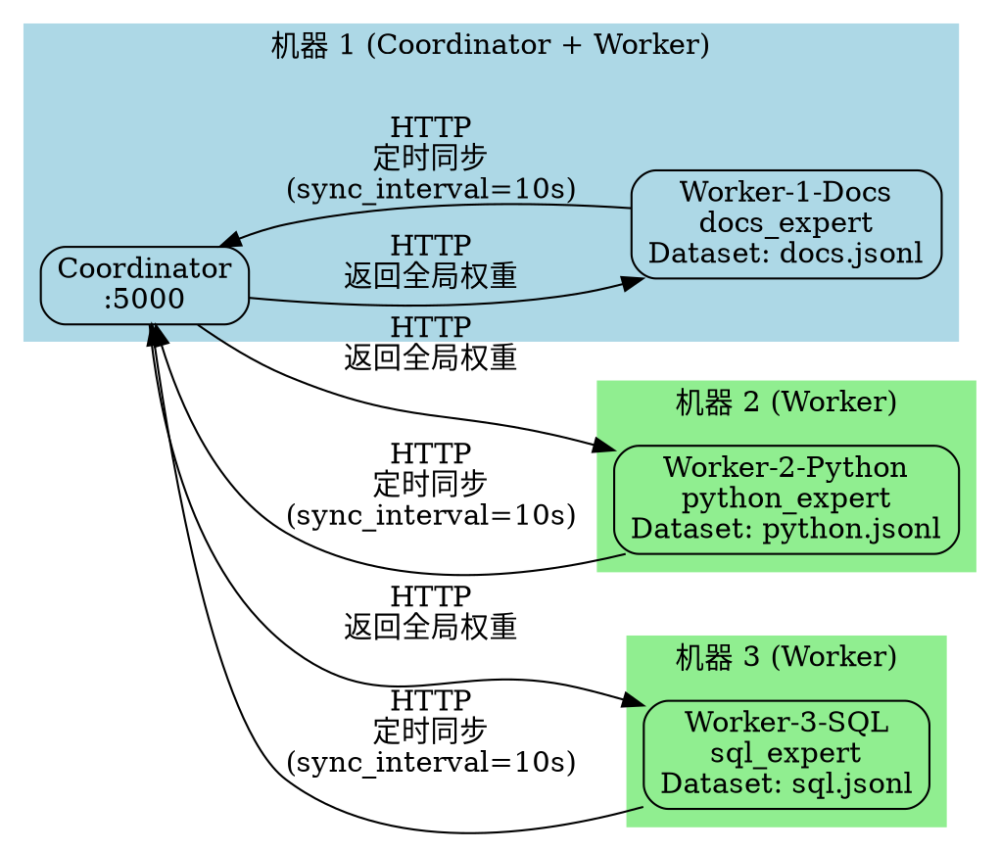
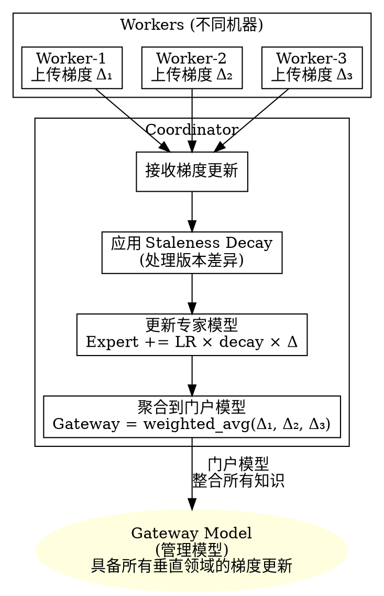

# FedMoE 系统架构图

## 系统架构概览

本文档使用 Graphviz DOT 语言描述 FedMoE 分布式联邦学习系统的架构。

## 完整架构图



## 数据流图



## 组件关系图

```dot
graph ComponentRelations {
    rankdir=TB;
    node [shape=box];
    
    subgraph cluster_core {
        label="核心模块";
        
        CC [label="CentralCoordinator\ncoordinator.py"];
        GM [label="GatewayModel\ncoordinator.py"];
        EM [label="ExpertModel\nexperts.py"];
    }
    
    subgraph cluster_distributed {
        label="分布式模块";
        
        DC [label="DistributedCoordinator\ndistributed_coordinator.py"];
        DW [label="DistributedWorker\ndistributed_worker.py"];
    }
    
    subgraph cluster_qwen {
        label="Qwen 模型模块";
        
        QE [label="QwenLoRAExpert\nqwen_finetune.py"];
        QW [label="QwenWorker\nqwen_worker.py"];
    }
    
    subgraph cluster_scripts {
        label="启动脚本";
        
        SC [label="start_coordinator.sh"];
        SW [label="start_worker.sh"];
        ST [label="status.sh"];
        SA [label="stop_all.sh"];
    }
    
    DC -> CC;
    DW -> DC [label="HTTP"];
    DW -> QE;
    CC -> EM;
    CC -> GM;
    QE -> EM [style=dashed, label="对应"];
    
    SC -> DC;
    SW -> DW;
}
```

## 文件结构图

```dot
digraph FileStructure {
    rankdir=TB;
    node [shape=folder];
    
    ROOT [label="FedMoE/"];
    
    subgraph cluster_fedmoe {
        label="fedmoe/";
        
        COORD [label="coordinator.py\nCentralCoordinator\nGatewayModel"];
        DCOORD [label="distributed_coordinator.py\nDistributedCoordinator\n(HTTP API)"];
        DWORKER [label="distributed_worker.py\nDistributedWorker\n(定时上传梯度)"];
        QFINETUNE [label="qwen_finetune.py\nQwenLoRAExpert\n(真实模型微调)"];
        QWORKER [label="qwen_worker.py\nQwenWorker"];
        EXPERTS [label="experts.py\nExpertModel"];
        CONFIG [label="config.py\n配置参数"];
    }
    
    subgraph cluster_scripts {
        label="scripts/";
        
        START_C [label="start_coordinator.sh"];
        STOP_C [label="stop_coordinator.sh"];
        START_W [label="start_worker.sh"];
        STOP_W [label="stop_worker.sh"];
        STATUS [label="status.sh"];
        STOP_ALL [label="stop_all.sh"];
    }
    
    subgraph cluster_root {
        label="根目录";
        
        RUN_C [label="run_coordinator.py"];
        RUN_W [label="run_worker.py"];
        GET_GW [label="get_gateway_model.py"];
    }
    
    ROOT -> cluster_fedmoe;
    ROOT -> cluster_scripts;
    ROOT -> cluster_root;
}
```



## 部署架构图



## 梯度聚合流程



## 使用说明

### 生成图片

要生成这些架构图的图片，需要安装 Graphviz：

```bash
# Ubuntu/Debian
sudo apt-get install graphviz

# macOS
brew install graphviz

# Windows
# 下载安装: https://graphviz.org/download/
```

然后使用以下命令生成图片：

```bash
# 生成完整架构图
dot -Tpng -o architecture.png ARCHITECTURE.md

# 或者使用 neato, fdp, sfdp, twopi, circo 等布局引擎
neato -Tpng -o architecture.png ARCHITECTURE.md
```

### 在线查看

也可以使用在线工具查看：
- https://dreampuf.github.io/GraphvizOnline/
- https://edotor.net/

直接将 DOT 代码复制到这些工具中即可查看和编辑。

